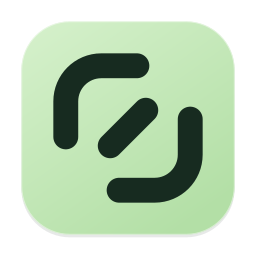

# AgentBuddy（搭子）

<p align="center">
  
</p>

<p align="center">
  <b>口袋里的编程搭档，让想法，向前一步。</b><br/>
  iOS / Android 原生 App，连接你自己 Mac 上的 Codex、Claude Code、Pi、OpenCode 等 AI 编程 agent。<br/>
  macOS 菜单栏 App 管理主机与配对，手机随时查看任务、继续对话和处理审批。
</p>

<p align="center">
  <a href="https://github.com/AkaShark/AgentBuddy">GitHub</a>
  &nbsp;·&nbsp;
  <a href="https://github.com/AkaShark/AgentBuddy/releases/latest">Releases</a>
  &nbsp;·&nbsp;
  <a href="docs/DEVELOPMENT.md">开发文档</a>
</p>

## 图标与启动页

三端统一使用薄荷绿与双括号连接标记，以下直接展示 App 使用的正式资源。

| iOS / iPadOS | Android | macOS |
|:---:|:---:|:---:|
| <picture><source media="(prefers-color-scheme: dark)" srcset="apps/ios/Sources/AgentBuddy/Assets.xcassets/AppIcon.appiconset/Icon-1024-dark.png" /></picture> |  |  |
| [SwiftUI 手机与平板 App](apps/ios/README.md) | [Compose 手机 App](apps/android/README.md) | [菜单栏主机与控制台](apps/desktop/README.md) |

iOS 提供浅色、深色与着色图标；Android 支持自适应与单色图标，桌面形状由系统启动器决定。
移动端启动页保留代理名称的纵向轮播，开启减少动画时显示静态名称。Android 的系统启动画面与 App 启动页连续衔接。

品牌矢量母版见 [agentbuddy-mark.svg](assets/brand/agentbuddy-mark.svg)，各平台图标由
[generate-brand-assets.cjs](tools/scripts/generate-brand-assets.cjs) 统一导出。

## 工作原理

AgentBuddy 分三层，手机 App 只做「遥控器」，真正的 agent 在你的 Mac 上运行：

```
┌──────────────────────────────┐
│  手机 App（iOS SwiftUI / Android Compose）
│  只负责 UI、平台权限、通知、音频等平台能力
└──────────────┬───────────────┘
               │ UniFFI 生成的 Swift / Kotlin 绑定
┌──────────────▼───────────────┐
│  Rust 共享核心  shared/rust-bridge/codex-mobile-client
│  会话/线程状态、流式更新、审批、账号、发现、SSH、语音状态
└──────────────┬───────────────┘
               │ 端到端加密 P2P（Iroh）/ 局域网 / SSH
┌──────────────▼───────────────┐
│  Mac 桌面 App 内置的守护进程 agentbuddy（alleycat 的品牌封装，services/kittylitter）
│  把本机 agent 多路复用给已配对的手机
└──────┬───────────┬───────────┬───────────┬──────┘
       │           │           │           │
   Codex      Claude Code      Pi       OpenCode …
 (app-server   (bridge 翻译   (bridge)   (bridge)
  协议直通)     成同一协议)
```

- **Codex** 走 app-server 协议直通：守护进程把 `codex app-server` 的 JSON-RPC 原样转给手机，Rust 核心直接复用上游 `codex-app-server-protocol`。
- **Claude Code、Pi、OpenCode 等其他 agent** 由 alleycat 里对应的 bridge（`alleycat-claude-bridge`、`alleycat-pi-bridge`、`alleycat-opencode-bridge`）翻译成同一套协议，手机端不需要知道差别。
- 两端共用一个 Rust 核心，Swift/Kotlin 保持很薄：状态机、合并策略、协议解析都不在平台层重复实现。
- P2P 连接使用 Iroh 端到端加密，网络需要时可通过 relay 中继连接；也支持局域网发现和 SSH 引导。

## 快速开始

首次构建前，请先按 [开发文档](docs/DEVELOPMENT.md) 准备 Xcode、rustup、xcodegen、Android SDK/NDK 与 JDK 17。
以下命令均在仓库根目录执行。

### 手机 App 开发

```bash
make ios-device-fast          # iOS 真机快速构建（raw staticlib）
make android-device-run       # Android 真机构建、安装并启动
make android-emulator-fast    # Android 模拟器快速构建
```

iOS 日常调试使用连接的 iPhone：打开 `apps/ios/AgentBuddy.xcodeproj`，选择 `AgentBuddy` scheme 与真机目的地。
平台目录说明见 [iOS](apps/ios/README.md) 和 [Android](apps/android/README.md)。

### Mac 端

下载 [Releases](https://github.com/AkaShark/AgentBuddy/releases) 里的 `AgentBuddy_<版本>_<架构>.dmg`，拖进 Applications 后打开。
在控制台点击「安装后台服务」，随后在「配对」页用手机 App 扫码；也可从菜单栏打开控制台。
守护进程作为 LaunchAgent 独立运行，退出 App 后继续工作，并在登录 macOS 后自动启动。
终端用户也可以直接调用包内的守护进程：

```bash
/Applications/AgentBuddy.app/Contents/MacOS/agentbuddy pair --qr
```

从源码运行桌面 App（需要 Node 22 和 rustup）：

```bash
npm --prefix apps/desktop ci
make desktop-dev
```

详见 [桌面 App 开发与发布](apps/desktop/README.md)。先在 Mac 上安装并配置要使用的 agent CLI，
按各 agent 的方式提供 API key 或完成账号登录；AgentBuddy 无需单独注册账号。

完整构建选项、发布与 SSH 配置见 [开发文档](docs/DEVELOPMENT.md)，仓库约定见 [AGENTS.md](AGENTS.md)。

## 仓库布局

```
apps/ios/                      iOS / watchOS App（AgentBuddy scheme，project.yml 是唯一真源）
apps/android/                  Android App（Compose UI，Gradle 构建，包名 com.akashark.agentbuddy.android）
apps/desktop/                  macOS 菜单栏主机 App（Tauri v2 + React/TS）
shared/rust-bridge/
  codex-mobile-client/         两端共用的 Rust 客户端 crate + UniFFI 公共面
  codex-slingshot/             JSON-line / websocket 传输适配
  codex-bridge/                旧的 C-FFI 支持层（不用于新功能）
  uniffi-bindgen/              绑定生成工具
shared/third_party/codex/      AkaShark/Codex fork 子模块（codex/agentbuddy 维护分支）
shared/third_party/ghostty/    AkaShark/Ghostty fork 子模块（终端渲染，同一维护分支名）
patches/codex/, patches/ghostty/  已迁入 fork 的历史补丁（构建不再应用）
services/kittylitter/          Mac 守护进程二进制 agentbuddy（alleycat 封装，作为桌面 App 的 sidecar）
services/push-proxy/           APNs / FCM 推送代理（Cloudflare Worker）
tools/scripts/                 跨平台辅助脚本
assets/brand/                  跨平台品牌矢量母版
docs/                          开发、架构与发布文档
```

## 致谢与许可

AgentBuddy 采用 **GNU GPLv3**，并依据 GPLv3 第 7 节附加了 Apple App Store / Google Play 分发例外，见 [LICENSE](LICENSE)。

衍生链：

**AgentBuddy** ← [包子 / Baozi](https://github.com/huangguang1999/baozi) ← [litter](https://github.com/dnakov/litter) + [alleycat](https://github.com/dnakov/alleycat)（作者 [@dnakov](https://github.com/dnakov)）

- [litter](https://github.com/dnakov/litter) 是最初的手机端 App 与 `kittylitter` Mac 守护进程，GPLv3。
- [alleycat](https://github.com/dnakov/alleycat) 是 P2P 传输与各 agent bridge，GPLv3。AgentBuddy 当前使用
  [AkaShark/alleycat](https://github.com/AkaShark/alleycat) fork，包含主机推送、额外 agent 支持与平台适配；
  移动端 bridge 与 Mac 守护进程分别固定到各自验证过的提交，具体版本以对应 `Cargo.toml` 为准。
- [包子 / Baozi](https://github.com/huangguang1999/baozi) 是 litter 的中文化换皮 fork，GPLv3；AgentBuddy 由它衍生而来。

源码文件头中保留的上游版权声明均为原作者所有。

## 常用构建命令

| 命令 | 说明 |
|---|---|
| `make ios-device-fast` | iOS 真机快速构建，链接 Rust 静态库 |
| `make android` | Android 开发构建，默认 arm64-v8a |
| `make android-device-run` | Android 真机构建、安装并启动 |
| `make android-emulator-fast` | 按当前 Mac 架构构建 Android 模拟器版本 |
| `make desktop-dev` | 构建 sidecar 并启动 macOS 桌面开发环境 |
| `make desktop-dist` | 构建 macOS DMG，签名与公证配置见桌面文档 |
| `make rust-check` | 检查共享 Rust crates |
| `make rust-test` | 运行共享 Rust 测试 |
| `make bindings` | 重新生成 UniFFI Swift / Kotlin 绑定 |
| `make xcgen` | 从 `project.yml` 重新生成 Xcode 工程 |
| `make watch-register` | 注册新配对的 Apple Watch 开发设备 |
| `make clean` | 清理构建产物 |
